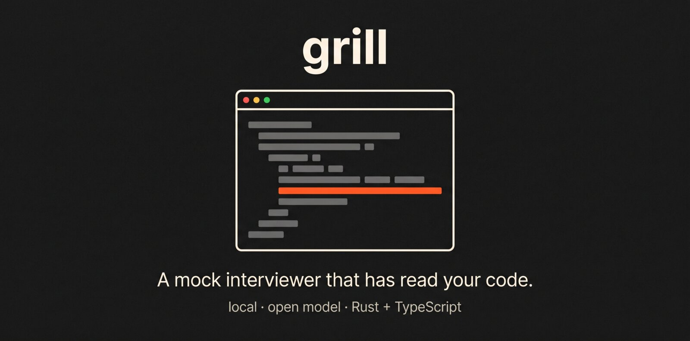
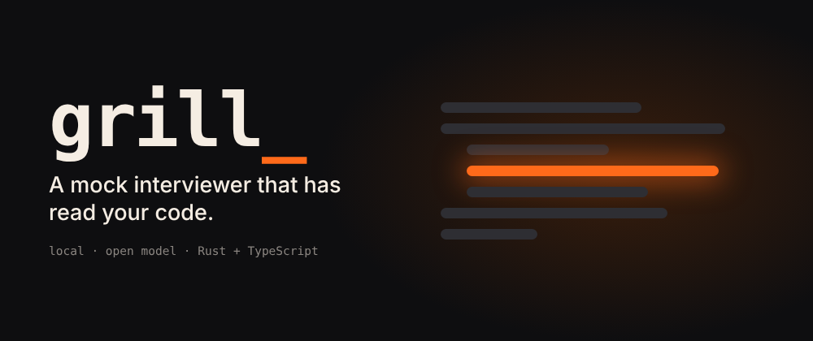
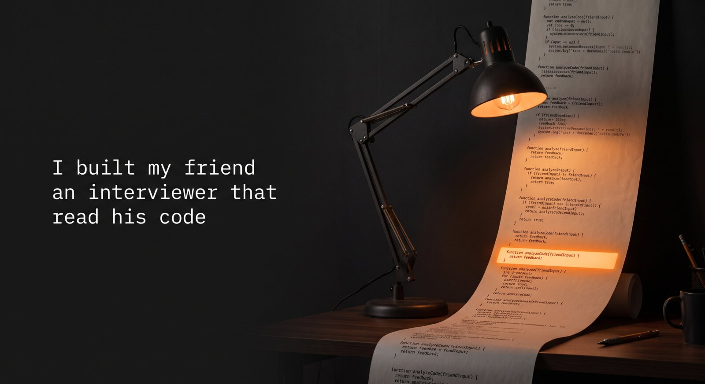
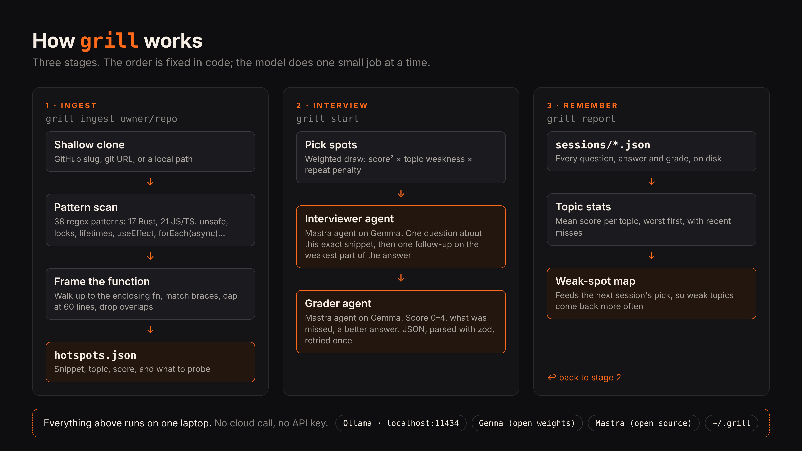
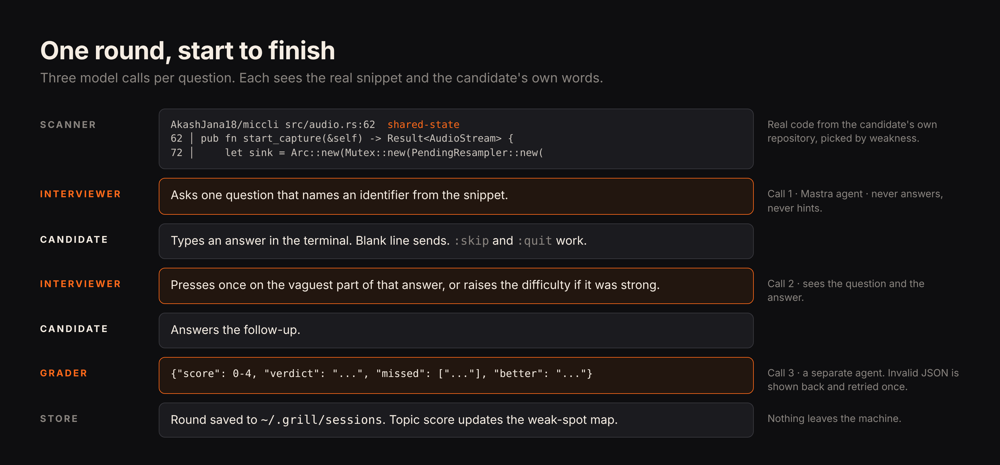

<p align="center">
  
</p>

# grill



A mock interviewer that has read your code. It runs on your laptop, on an open model, with no network.

Most interview prep asks textbook questions. Real senior interviews ask "walk me through your project", then press on the one line you hoped nobody would notice. `grill` clones your repositories, finds those lines, and asks about them.

Built for [Akash](https://github.com/AkashJana18), who writes Rust and TypeScript and is interviewing for full-time roles.

<p align="center">
  
</p>

```
── 1 of 5 ──
AkashJana18/miccli src/audio.rs:62  shared-state
62 │     pub fn start_capture(&self) -> Result<AudioStream> {
63 │         let (tx, rx) = mpsc::channel();
   │         ...
72 │         let sink = Arc::new(Mutex::new(PendingResampler::new(
   │         ...

Why is `sink` behind a Mutex, and what does the audio callback do if that lock is contended?
  >
```

The code and location above are real scanner output. The question is an example of the kind a model asks; yours will differ.

## How it works



1. **Ingest.** Shallow-clones each repository and scans Rust, TypeScript and JavaScript for code worth a question: `unsafe`, locks, lifetimes, spawned tasks, `useEffect`, `forEach(async ...)`, `any`, empty `catch`, and more. Each hit is framed as the whole enclosing function.
2. **Interview.** For each spot, a local model asks one question about that exact code, listens, presses once on the weakest part of the answer, then grades the exchange 0 to 4 and says what was missed.
3. **Remember.** Scores are filed by topic. The next session draws more from the topics you scored worst on.

The order of steps is fixed in code. The model only ever does one small job at a time, so a small local model is enough.



## Run it

Needs Node 22.13+ and [Ollama](https://ollama.com).

```sh
ollama pull gemma3:4b

git clone https://github.com/yashksaini-coder/grill && cd grill
npm install && npm run build && npm link

grill ingest AkashJana18/miccli AkashJana18/solana-consensus-lab
grill start                # 5 questions
grill start -n 3 --lang rust
grill report               # the weak-spot map
grill spots                # everything it found
```

`grill ingest` also takes a git URL or a local path, so private code works without leaving the machine.

## Configuration

| Variable      | Default                     | Meaning                                                      |
| ------------- | --------------------------- | ------------------------------------------------------------ |
| `GRILL_MODEL` | `gemma3:4b`                 | Any model your local server has                              |
| `GRILL_URL`   | `http://localhost:11434/v1` | Any OpenAI-compatible endpoint: Ollama, llama.cpp, LM Studio |
| `GRILL_HOME`  | `~/.grill`                  | Where clones, spots and sessions are kept                    |

`grill start --tools` lets the interviewer read beyond the snippet (callers, type definitions) through a `read_source` tool that is confined to the repository. It needs a model that supports tool calling.

## What is open here

- **Model:** Gemma, open weights, served by Ollama on your own machine.
- **Agents:** [Mastra](https://mastra.ai), open source. Two agents (interviewer, grader) and one tool.
- **Everything else:** this repository, MIT.

Your code, your answers, and your scores stay in `~/.grill`. Nothing is sent anywhere.

## Layout

```
src/ingest      clone, pattern table, snippet framing, scanner
src/interview   prompts and agents, question selection, the session loop
src/store.ts    sessions and per-topic stats on disk
src/cli.ts      commands
test/           scanner, selection, and end-to-end runs against a fake local model
```

```sh
npm test
```

## Limits

- The scanner is regex and brace counting, not a parser. It finds interesting code; it does not understand it.
- Question quality is the model's. A larger local model asks sharper questions.
- Grades are a study aid, not a verdict.

## License

MIT
